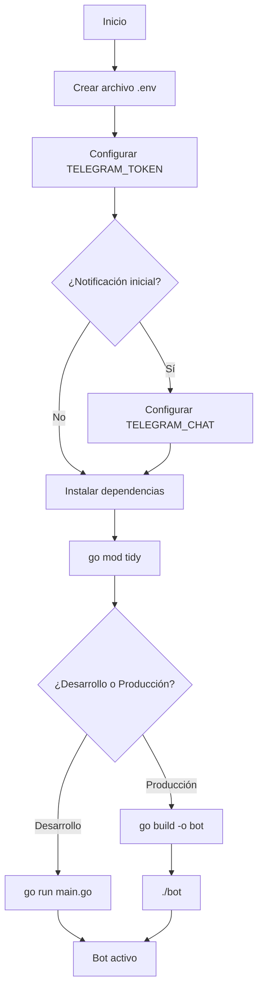
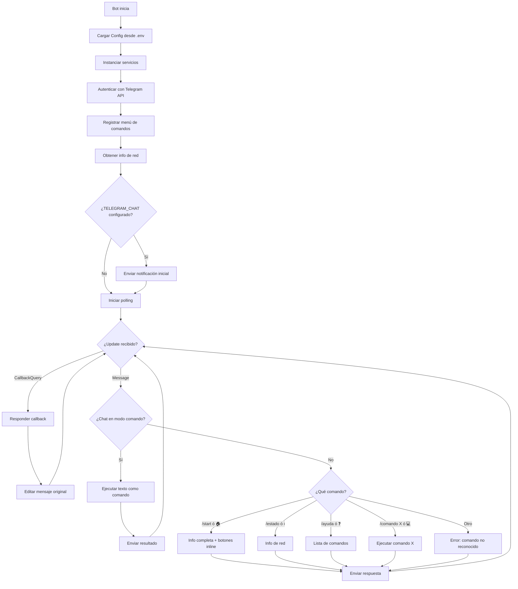
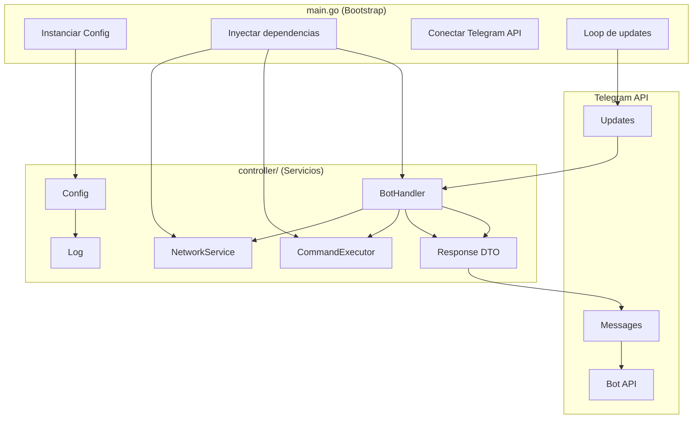

# Guía para configurar bot de telegram

## 📋 Requisitos y configuración inicial

### 1. Configuración de variables de entorno

Crea un archivo `.env` basado en `example` con esta estructura:

```bash
# Configuración bot de telegram
TELEGRAM_TOKEN=token_de_tu_bot_en_telegram
TELEGRAM_CHAT=id_de_chat_para_notificacion_inicial
```

| Variable | Descripción | Obligatorio |
|----------|-------------|-------------|
| `TELEGRAM_TOKEN` | Token obtenido de [@BotFather](https://t.me/BotFather) | ✅ Sí |
| `TELEGRAM_CHAT` | ID numérico del chat donde se enviará la notificación de inicio | ❌ Opcional |

### 2. Instalar dependencias

```bash
go mod tidy
```

### 3. Ejecutar proyecto

```bash
go run main.go
```

### 4. Compilar a binario (producción)

```bash
# Linux/macOS
go build -o bot-telegram main.go

# Windows
go build -o bot-telegram.exe main.go

# Compilación cruzada (ej: compilar para Linux desde Windows)
GOOS=linux GOARCH=amd64 go build -o bot-telegram main.go
```

## 🔒 Seguridad

### Lista blanca de usuarios

Configura `ALLOWED_USERS` en `.env` con los IDs de usuarios autorizados (separados por coma):

```bash
ALLOWED_USERS=123456789,987654321
```

---

## 🤖 Funcionalidades del Bot

### Comandos disponibles

| Comando | Descripción |
|---------|-------------|
| `/start` | Muestra información completa: IP pública, IP local, red, OS y arquitectura |
| `/estado` | Muestra solo información de red (IPs y red conectada) |
| `/comando <cmd>` | Ejecuta un comando del sistema y retorna el resultado |
| `/comando` | Modo interactivo: pide el comando en el siguiente mensaje |
| `/ayuda` | Lista de comandos disponibles |

### Botones persistentes (Reply Keyboard)

Siempre visibles en la parte inferior del chat:

| Botón | Equivalente | Acción |
|-------|-------------|--------|
| 🏠 | `/icono home` | Muestra información completa (equivale a `/start`) |
| ❓ | `/icono help` | Muestra ayuda (equivale a `/ayuda`) |
| 💻 | `/icono bash` | Activa modo comando (pide input en siguiente mensaje) |

### Botones inline (contextuales)

Aparecen debajo de mensajes específicos para acciones rápidas:

- En `/start`: `[📊 Ver Estado] [❓ Ayuda]`
- En `/ayuda`: `[🏠 Inicio] [📊 Estado]`

### Notificación automática

Al iniciar, el bot envía automáticamente un mensaje al `TELEGRAM_CHAT` configurado con:
- Estado del sistema
- IP pública, IP local y red conectada

---

## 🛠️ Procesos de automatización

### Compilación multiplataforma

```bash
# Windows
set GOOS=windows&& set GOARCH=amd64&& go build -o bot.exe main.go

# Linux
GOOS=linux GOARCH=amd64 go build -o bot main.go

# macOS
GOOS=darwin GOARCH=amd64 go build -o bot main.go

# ARM (Raspberry Pi)
GOOS=linux GOARCH=arm64 go build -o bot main.go
```

### Ejecución como servicio (Linux)

Crear `/etc/systemd/system/bot-telegram.service`:

```ini
[Unit]
Description=Bot de Telegram
After=network.target

[Service]
Type=simple
User=tu_usuario
WorkingDirectory=/ruta/al/proyecto
ExecStart=/ruta/al/proyecto/bot
Restart=always
RestartSec=10
EnvironmentFile=/ruta/al/proyecto/.env

[Install]
WantedBy=multi-user.target
```

```bash
sudo systemctl daemon-reload
sudo systemctl enable bot-telegram
sudo systemctl start bot-telegram
sudo systemctl status bot-telegram
```

---

## 📂 **Estructura del Proyecto**

```
go-tel/
├── main.go                    # Bootstrap: instancia servicios y arranca el bot
├── go.mod                     # Dependencias del proyecto
├── go.sum                     # Checksums de dependencias
├── .env                       # Variables de entorno (no subir a git)
├── example               # Template de variables de entorno
├── .gitignore                 # Archivos ignorados
├── README.md                  # Esta documentación
├── /controller                # Lógica de negocio (servicios)
│   ├── Config.go              # Configuración central con defaults
│   ├── Log.go                 # Sistema de logging thread-safe
│   ├── NetworkInfo.go         # Servicio: información de red e IPs
│   ├── CommandExecutor.go     # Servicio: ejecución de comandos del sistema
│   ├── BotHandler.go          # Orquestador: ruteo de mensajes a servicios
│   ├── Response.go            # DTO: respuesta estructurada (texto + botones)
│   └── helpers.go             # Utilidades privadas del paquete
└── /logs                      # Directorio de logs (autogenerado)
    ├── /procesos              # Logs de procesos por fecha
    └── /errores               # Logs de errores por fecha
```

---

## 🔄 Diagrama de Configuración



---

## 🔄 Diagrama de Flujo del Bot



---

## 🔄 Diagrama de Arquitectura (Separación de Responsabilidades)



---

## 🔒 Seguridad

- **Timeout de comandos**: 30 segundos por defecto (configurable en `CommandExecutor`)
- **Longitud máxima de output**: 4000 caracteres (evita saturar Telegram)
- **Logs thread-safe**: escritura concurrente protegida con mutex
- **Context cancellation**: comandos cancelables vía `context.WithTimeout`

> **⚠️ Nota de seguridad**: El bot ejecuta cualquier comando que reciba. En producción, considera implementar:
> - Sandbox de comandos permitidos
> - Rate limiting

---

## 💡 **Créditos**

[Plantilla base](https://github.com/villalbaluis/arquitectura-bots-python) proporcionada por [Luis Villalba](https://github.com/villalbaluis)

Migración a Go y refactorización de arquitectura: adaptación propia basada en principios de:
- Single Responsibility Principle (SRP)
- Dependency Injection
- Separation of Concerns