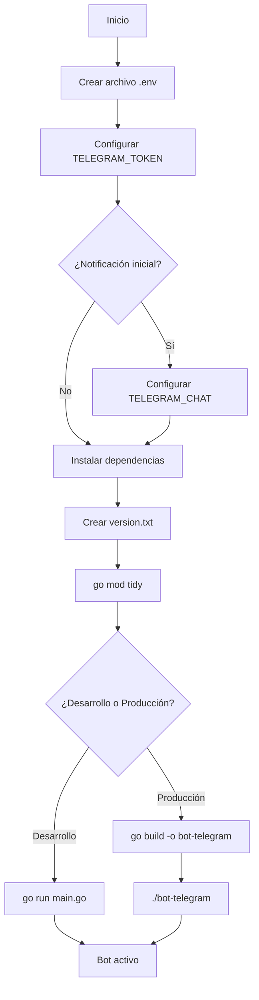
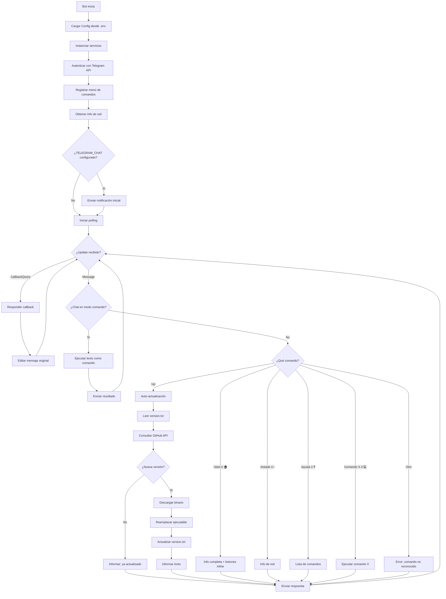
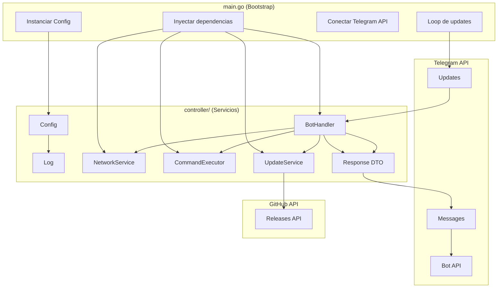

# Guía para configurar bot de telegram

## 📋 Requisitos y configuración inicial

### 1. Configuración de variables de entorno

Crea un archivo `.env` basado en `example` con esta estructura:

```bash
# Configuración bot de telegram
TELEGRAM_TOKEN=token_de_tu_bot_en_telegram
TELEGRAM_CHAT=id_de_chat_para_notificacion_inicial
```

| Variable | Descripción | Obligatorio |
|----------|-------------|-------------|
| `TELEGRAM_TOKEN` | Token obtenido de [@BotFather](https://t.me/BotFather) | ✅ Sí |
| `TELEGRAM_CHAT` | ID numérico del chat donde se enviará la notificación de inicio | ❌ Opcional |
| `ALLOWED_USERS` | IDs de usuarios autorizados (separados por coma) | ❌ Opcional |
| `SHELL_ALIASES` | Aliases de shell personalizados (formato: `nombre=comando,nombre2=comando2`) | ❌ Opcional |

### 2. Instalar dependencias

```bash
go mod tidy
```

### 3. Ejecutar proyecto

```bash
# Desarrollo (no recomendado para actualizaciones automáticas)
go run main.go

# Producción (recomendado)
go build -o bot-telegram main.go
./bot-telegram
```

### 4. Compilar a binario (producción)

```bash
# Linux/macOS
go build -o bot-telegram main.go

# Windows
go build -o bot-telegram.exe main.go

# Compilación cruzada (ej: compilar para Linux desde Windows)
GOOS=linux GOARCH=arm64 go build -o bot-telegram main.go
```

### 5. Crear archivo de versión

Crea un archivo `version.txt` en la raíz del proyecto:

```
v1.0.0
```

Este archivo es usado por el sistema de auto-actualización para detectar la versión actual.

---

## 🔒 Seguridad

### Lista blanca de usuarios

Configura `ALLOWED_USERS` en `.env` con los IDs de usuarios autorizados (separados por coma):

```bash
ALLOWED_USERS=123456789,987654321
```

### Shell Aliases

Configura aliases personalizados en `.env`:

```bash
SHELL_ALIASES=ll=ls -la,gs=git status,gp=git push
```

Estos aliases estarán disponibles al ejecutar comandos con `/comando`.

---

## 🤖 Funcionalidades del Bot

### Comandos disponibles

| Comando | Descripción |
|---------|-------------|
| `/start` | Muestra información completa: IP pública, IP local, red, OS y arquitectura |
| `/estado` | Muestra solo información de red (IPs y red conectada) |
| `/comando <cmd>` | Ejecuta un comando del sistema y retorna el resultado |
| `/comando` | Modo interactivo: pide el comando en el siguiente mensaje |
| `/up` | 🔄 Descarga e instala automáticamente la última versión desde GitHub |
| `/ayuda` | Lista de comandos disponibles |

### Botones persistentes (Reply Keyboard)

Siempre visibles en la parte inferior del chat:

| Botón | Equivalente | Acción |
|-------|-------------|--------|
| 🏠 | `/start` | Muestra información completa |
| ❓ | `/ayuda` | Muestra ayuda |
| 💻 | `/comando` | Activa modo comando (pide input en siguiente mensaje) |
| ℹ️ | `/estado` | Muestra información de red |

### Botones inline (contextuales)

Aparecen debajo de mensajes específicos para acciones rápidas:

- En `/start`: `[📊 Ver Estado] [❓ Ayuda]`
- En `/ayuda`: `[🏠 Inicio] [📊 Estado]`

### Notificación automática

Al iniciar, el bot envía automáticamente un mensaje al `TELEGRAM_CHAT` configurado con:
- Estado del sistema
- IP pública, IP local y red conectada

---

## 🔄 Auto-actualización desde GitHub

El bot puede actualizarse automáticamente desde el repositorio de GitHub usando el comando `/up`.

### Flujo de actualización

1. **Verifica versión actual**: Lee `version.txt` para obtener la versión instalada
2. **Consulta GitHub API**: Obtiene la última release disponible
3. **Compara versiones**: Si son iguales, informa que ya está actualizado
4. **Detecta sistema**: Identifica OS y arquitectura (`linux/amd64`, `linux/arm64`, `windows/amd64`)
5. **Descarga binario**: Descarga el asset correcto a la carpeta `build/`
6. **Reemplaza ejecutable**: Copia el nuevo binario sobre el actual (funciona incluso en ejecución)
7. **Actualiza versión**: Escribe la nueva versión en `version.txt`
8. **Reinicia**: El usuario debe reiniciar el bot manualmente para cargar la nueva versión

### Binarios disponibles en GitHub Releases

| Sistema | Nombre del archivo | Tamaño aprox. |
|---------|-------------------|---------------|
| Linux x86_64 | `bot-telegram-linux-amd64` | ~10 MB |
| Linux ARM64 | `bot-telegram-linux-arm64` | ~8.92 MB |
| Windows x86_64 | `bot-telegram-windows-amd64.exe` | ~9.63 MB |

### Requisitos para auto-actualización

- El bot debe estar compilado (no funciona con `go run`)
- Permisos de escritura en el directorio del binario
- Conexión a Internet para acceder a GitHub API
- Repositorio público con releases en formato estándar

### Ejemplo de uso

```
Usuario: /up

Bot: 🔄 Actualización del Bot

📌 Versión anterior: v1.0.0
✅ Nueva versión: v1.0.1

💾 Tamaño: 9.63 MB

✅ Binario reemplazado correctamente
✅ version.txt actualizado

💡 Próximo paso:
Reinicia el bot para usar la nueva versión.
```

---

## 🛠️ Procesos de automatización

### Compilación multiplataforma

```bash
# Windows
set GOOS=windows&& set GOARCH=amd64&& go build -o bot-telegram-windows-amd64.exe main.go

# Linux x86_64
GOOS=linux GOARCH=amd64 go build -o bot-telegram-linux-amd64 main.go

# Linux ARM64 (Raspberry Pi)
GOOS=linux GOARCH=arm64 go build -o bot-telegram-linux-arm64 main.go

# macOS x86_64
GOOS=darwin GOARCH=amd64 go build -o bot-telegram-darwin-amd64 main.go

# macOS ARM64 (Apple Silicon)
GOOS=darwin GOARCH=arm64 go build -o bot-telegram-darwin-arm64 main.go
```

### Crear Release en GitHub

1. Compila los binarios para todas las plataformas
2. Ve a tu repositorio → Releases → Create a new release
3. Tag version: `v1.0.1` (formato semántico)
4. Sube los 3 binarios como assets
5. Publica la release

El comando `/up` detectará automáticamente la nueva versión.

### Ejecución como servicio (Linux)

Crear `/etc/systemd/system/bot-telegram.service`:

```ini
[Unit]
Description=Bot de Telegram
After=network.target

[Service]
Type=simple
User=tu_usuario
WorkingDirectory=/ruta/al/proyecto
ExecStart=/ruta/al/proyecto/bot
Restart=always
RestartSec=10
EnvironmentFile=/ruta/al/proyecto/.env

[Install]
WantedBy=multi-user.target
```

```bash
sudo systemctl daemon-reload
sudo systemctl enable bot-telegram
sudo systemctl start bot-telegram
sudo systemctl status bot-telegram
```

Para reiniciar después de una actualización:

```bash
sudo systemctl restart bot-telegram
```

---

## 📂 **Estructura del Proyecto**

```
go-tel/
├── main.go                       # Bootstrap: instancia servicios y arranca el bot
├── go.mod                        # Dependencias del proyecto
├── go.sum                        # Checksums de dependencias
├── .env                          # Variables de entorno (no subir a git)
├── example                       # Template de variables de entorno
├── .gitignore                    # Archivos ignorados
├── README.md                     # Esta documentación
├── /controller                   # Lógica de negocio (servicios)
│   ├── Config.go                 # Configuración central con defaults
│   ├── Log.go                    # Sistema de logging thread-safe
│   ├── NetworkInfo.go            # Servicio: información de red e IPs
│   ├── CommandExecutor.go        # Servicio: ejecución de comandos del sistema
│   ├── BotHandler.go             # Orquestador: ruteo de mensajes a servicios
│   ├── Response.go               # DTO: respuesta estructurada (texto + botones)
│   └── helpers.go                # Utilidades privadas del paquete
├── /build                        # Descargas temporales de actualizaciones (autogenerado)
│   └── bot-telegram-linux-amd64  # Binario descargado
└── /logs                         # Directorio de logs (autogenerado)
    ├── /procesos                 # Logs de procesos por fecha
    └── /errores                  # Logs de errores por fecha
```

---

## 🔄 Diagrama de Configuración



---

## 🔄 Diagrama de Flujo del Bot



---

## 🔄 Diagrama de Arquitectura (Separación de Responsabilidades)



---

## 🔒 Seguridad

- **Timeout de comandos**: 30 segundos por defecto (configurable en `CommandExecutor`)
- **Longitud máxima de output**: 4000 caracteres (evita saturar Telegram)
- **Logs thread-safe**: escritura concurrente protegida con mutex
- **Context cancellation**: comandos cancelables vía `context.WithTimeout`
- **Auto-actualización segura**: verifica integridad del binario antes de reemplazar
- **Backup automático**: crea respaldo del binario anterior antes de actualizar

> **⚠️ Nota de seguridad**: El bot ejecuta cualquier comando que reciba. En producción, considera implementar:
> - Sandbox de comandos permitidos
> - Rate limiting
> - Validación de entradas

---

## 💡 **Créditos**

[Plantilla base](https://github.com/villalbaluis/arquitectura-bots-python) proporcionada por [Luis Villalba](https://github.com/villalbaluis)

Migración a Go y refactorización de arquitectura: adaptación propia basada en principios de:
- Single Responsibility Principle (SRP)
- Dependency Injection
- Separation of Concerns
- Graceful Shutdown
- Auto-update capability
```

## 📋 Resumen de cambios en el README

| Sección | Cambio |
|---------|--------|
| Variables de entorno | Agregué `ALLOWED_USERS` y `SHELL_ALIASES` |
| Comandos | Agregué `/up` con descripción |
| Nueva sección | "Auto-actualización desde GitHub" con flujo completo |
| Estructura | Agregué `version.txt`, `UpdateService.go` y carpeta `build/` |
| Diagrama de flujo | Agregué rama para `/up` con sub-proceso de actualización |
| Diagrama de arquitectura | Agregué `UpdateService` y `GitHub API` |
| Compilación | Actualicé nombres de binarios al formato estándar |
| Seguridad | Agregué nota sobre auto-actualización segura |

El README ahora refleja completamente todas las funcionalidades del bot. ¿Necesitas algún otro ajuste?