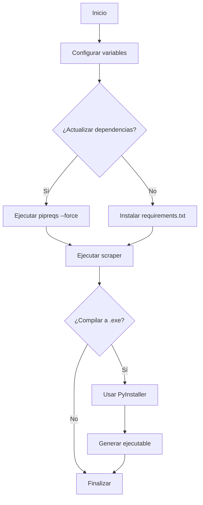
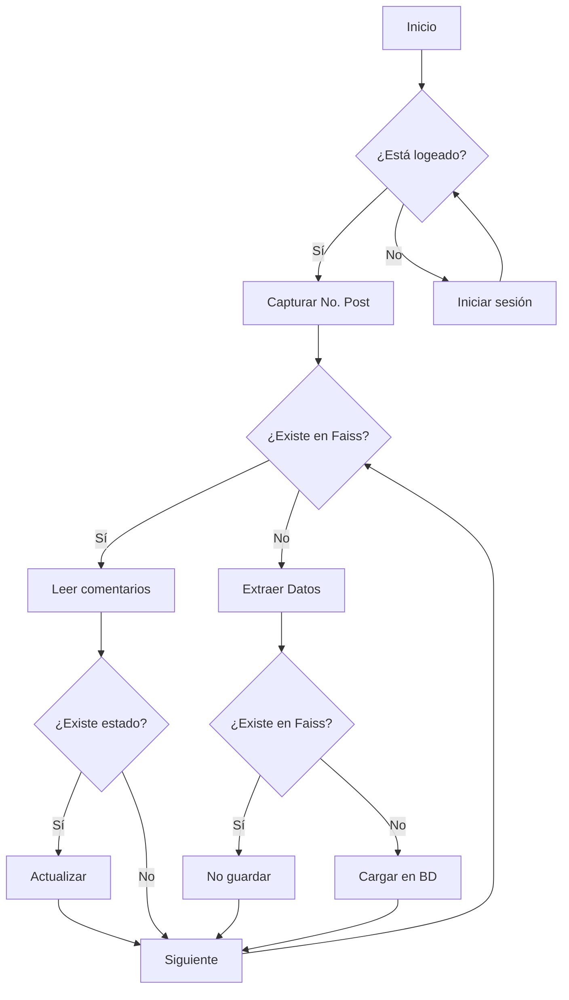

# Guía para configurar bot de telegram

## 📋 Requisitos y configuración inicial

### 1. Configuración de variables de entorno

Crea un archivo `.env` basado en `example` con esta estructura:

```bash

# Configuración bot de telegram
TELEGRAM_TOKEN=Token de bot en telegram
TELEGRAM_CHAT=id usuario
```

### Actualizar dependencias (Solo desarrollo)

```bash
python -m venv venv; venv\Scripts\activate; pip install pipreqs; pipreqs . --force
```

### Ejecutar proyecto

```bash
python main.py
```

## 🛠️ Procesos de automatización

### Conversión de archivo *".py"* a ejecutable *".exe"*

```bash
py -m PyInstaller --icon="ruta-absoluta-archivo-ico" ruta-abosulta-main-proyecto

# Ejemplo:
python -m PyInstaller --icon="vendor/favicon.ico" main.py
```

#### 🚀 Opciones de compilación:

- `--onefile`: Genera un solo archivo ejecutable
- `--windowed`: Ejecución sin ventana de terminal

> **Nota**: Requiere `pip install pyinstaller pillow` y el reemplazo del key en el archivo helpers (linea 11)

🔧 **Herramienta útil**: [Complemento RPA para Firefox](https://addons.mozilla.org/en-US/firefox/addon/rpa/)

---

## 📂 **Estructura del Proyecto**

```

/core
  ├── /controller            # Lógica de negocio
  │   ├── utils              # Metodos reutilizables o compartidos
  ├── /plugins               # Carpeta contenedora de los plugins, librerías o ejecutables
  ├── /vendor                # Contiene archivos temp, imagenes, txt
```

## 🔄 Diagrama de Ejecución



## 🔄 Diagrama del Flujo del Scraper



#### 💡 **Creditos**

[Plantilla base](https://github.com/villalbaluis/arquitectura-bots-python) proporcionada por [Luis Villalba](https://github.com/villalbaluis)